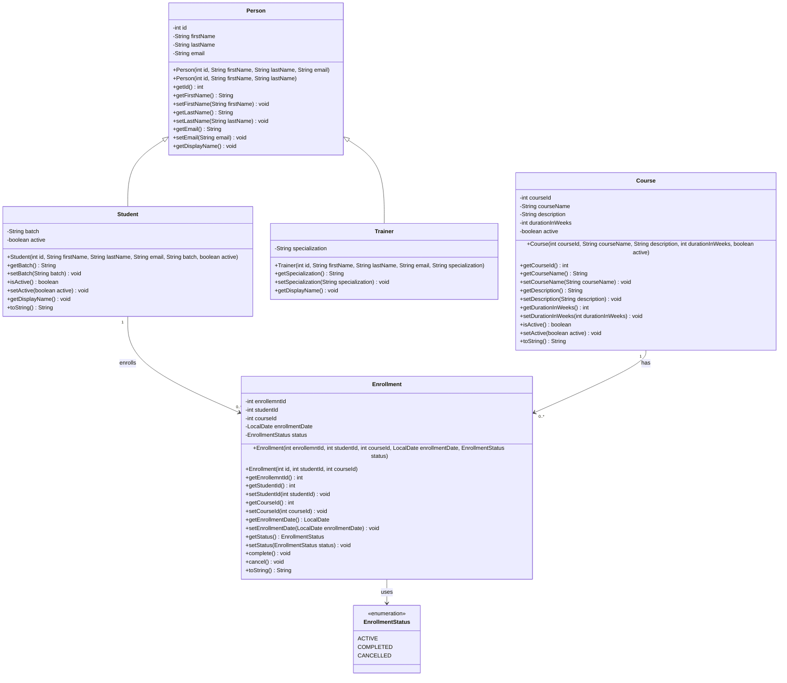

# LearnTrack

## Student & Course Management System

LearnTrack is a console-based Student & Course Management System developed using Core Java.

The application allows an administrator to manage students, courses, and enrollments through a menu-driven console interface.

---

## Features

### Student Management

- Add a new student
- View all students
- Search for a student by ID
- Deactivate a student

### Course Management

- Add a new course
- View all courses
- Activate a course
- Deactivate a course

### Enrollment Management

- Enroll a student in a course
- View enrollments for a student
- Complete an enrollment
- Cancel an enrollment

---

## Prerequisites

The following is required to run the application:

- JDK 17 or later

---

## Project Structure

```text
LearnTrack/
│
├── docs/
│   ├── Design_Notes.md
│   ├── JVM_Basics.md
│   └── Setup_Instructions.md
│
├── src/
│   └── com/
│       └── learntrack/
│           │
│           ├── constants/
│           │   └── MenuConstants.java
│           │
│           ├── entity/
│           │   ├── Course.java
│           │   ├── Enrollment.java
│           │   ├── Person.java
│           │   ├── Student.java
│           │   └── Trainer.java
│           │
│           ├── enums/
│           │   └── EnrollmentStatus.java
│           │
│           ├── exception/
│           │   ├── EntityNotFoundException.java
│           │   └── InvalidInputException.java
│           │
│           ├── service/
│           │   ├── CourseService.java
│           │   ├── EnrollmentService.java
│           │   └── StudentService.java
│           │
│           ├── ui/
│           │   └── Main.java
│           │
│           └── util/
│               ├── IdGenerator.java
│               └── InputValidator.java
│
├── .gitignore
└── README.md
```

---

## Package Responsibilities

### `entity`

Contains the classes representing the main entities of the application.

- `Person` - Contains common personal information.
- `Student` - Represents a student and extends `Person`.
- `Trainer` - Represents a trainer and extends `Person`.
- `Course` - Represents a course offered by LearnTrack.
- `Enrollment` - Represents a student's enrollment in a course.

### `enums`

Contains enumerations used by the application.

- `EnrollmentStatus` - Represents the possible states of an enrollment.

### `service`

Contains the business logic of the application.

- `StudentService` - Manages student-related operations.
- `CourseService` - Manages course-related operations.
- `EnrollmentService` - Manages enrollment-related operations and coordinates with student and course services.

### `exception`

Contains custom exceptions used by the application.

- `EntityNotFoundException`
- `InvalidInputException`

### `util`

Contains reusable utility classes.

- `IdGenerator` - Generates unique sequential IDs.
- `InputValidator` - Provides input validation methods.

### `constants`

Contains application-wide constants.

- `MenuConstants` - Defines constants used for menu options.

### `ui`

Contains the console user interface.

- `Main` - Application entry point that displays menus, accepts user input, and invokes service operations.

---

## Class Diagram

The class diagram below represents the main entities and their relationships in the LearnTrack system.



---

## How to Run

### 1. Compile the source files

From the project root directory, create the output directory:

```bash
mkdir out
```

For **Linux/macOS/Git Bash**, use:

```bash
javac -d out $(find src -name "*.java")
```

The compiled `.class` files will be generated inside the `out` directory according to their package structure.

### 2. Run the application

Run the `Main` class using its fully qualified class name:

```bash
java -cp out com.learntrack.ui.Main
```

---

## Documentation

Additional project documentation is available in the `docs` directory.

### Setup Instructions

[`docs/Setup_Instructions.md`](docs/Setup_Instructions.md)

Contains instructions for setting up the Java development environment and running the project.

### JVM Basics

[`docs/JVM_Basics.md`](docs/JVM_Basics.md)

Contains information about:

- JDK
- JRE
- JVM
- Java bytecode
- Write Once, Run Anywhere (WORA)

### Design Notes

[`docs/Design_Notes.md`](docs/Design_Notes.md)

Contains design decisions, class responsibilities, and other implementation details of the LearnTrack application.
